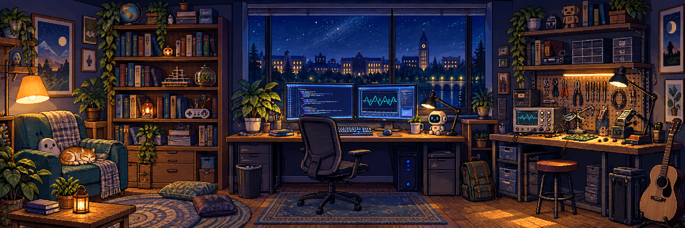
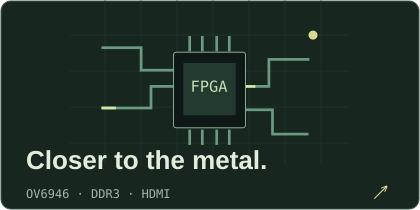
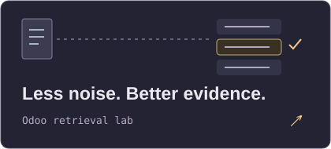
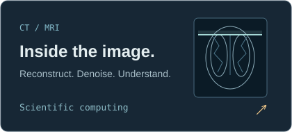
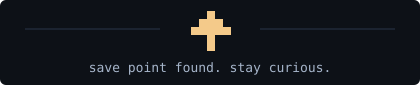

  
  <picture>
    <source media="(prefers-reduced-motion: reduce) and (max-width: 600px)" srcset="./assets/still/welcome-mobile.svg" />
    <source media="(prefers-reduced-motion: reduce)" srcset="./assets/still/welcome.svg" />
    <source media="(max-width: 600px)" srcset="./assets/welcome-mobile.svg" />
    
  </picture>

  <b>University of Cambridge</b> · MPhil student in Data Intensive Science 
  <b>UCL</b> · BEng in EEE

  <a href="https://sanssssssssssssssss.github.io/">Website</a> &nbsp; / &nbsp;
  <a href="https://github.com/Sanssssssssssssssss?tab=repositories">All projects</a>

  <a href="https://github.com/Sanssssssssssssssss/pi-agent-python"><picture><source media="(prefers-reduced-motion: reduce) and (max-width: 480px)" srcset="./assets/still/agent-terminal-mobile.svg" /><source media="(prefers-reduced-motion: reduce)" srcset="./assets/still/agent-terminal.svg" /><source media="(max-width: 480px)" srcset="./assets/agent-terminal-mobile.svg" /></picture></a>
  &nbsp;&nbsp;
  <a href="https://github.com/Sanssssssssssssssss/ov6946-fpga-image-preprocess-accel-pipeline"><picture><source media="(prefers-reduced-motion: reduce) and (max-width: 480px)" srcset="./assets/still/fpga-mobile.svg" /><source media="(prefers-reduced-motion: reduce)" srcset="./assets/still/fpga.svg" /><source media="(max-width: 480px)" srcset="./assets/fpga-mobile.svg" /></picture></a>
    
  <a href="https://github.com/Sanssssssssssssssss/odoo-semantic-retrieval-lab"><picture><source media="(prefers-reduced-motion: reduce) and (max-width: 480px)" srcset="./assets/still/retrieval-mobile.svg" /><source media="(prefers-reduced-motion: reduce)" srcset="./assets/still/retrieval.svg" /><source media="(max-width: 480px)" srcset="./assets/retrieval-mobile.svg" /></picture></a>
  &nbsp;&nbsp;
  <a href="https://github.com/Sanssssssssssssssss/ct-mri-medical-imaging-workflows"><picture><source media="(prefers-reduced-motion: reduce) and (max-width: 480px)" srcset="./assets/still/imaging-mobile.svg" /><source media="(prefers-reduced-motion: reduce)" srcset="./assets/still/imaging.svg" /><source media="(max-width: 480px)" srcset="./assets/imaging-mobile.svg" /></picture></a>

<code>Python</code> &nbsp; <code>C / C++</code> &nbsp; <code>FPGA</code> &nbsp; <code>SQL</code> &nbsp; <code>Linux</code>

Also on the bench: <a href="https://github.com/Sanssssssssssssssss/ecg_sqi_fusion">ECG quality</a> · <a href="https://github.com/Sanssssssssssssssss/openmp-cholesky-factorization">OpenMP</a> · <a href="https://github.com/Sanssssssssssssssss/GRPO-inf">GRPO experiments</a>

<b>🎮 Side quests</b> &nbsp; <a href="https://github.com/Sanssssssssssssssss/manga-loader-skill">Manga → EPUB</a> &nbsp; / &nbsp; <a href="https://github.com/Sanssssssssssssssss/Potato_Game-">Spud Arena</a>

  
  &nbsp;&nbsp;
  

<picture><source media="(prefers-reduced-motion: reduce)" srcset="./assets/still/save-point.svg" /></picture>

